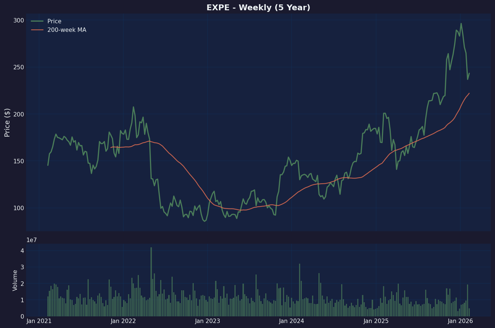

# Expedia Group (EXPE) Deep Dive
*February 10, 2026*

## Company Overview

**Expedia Group, Inc.** (NASDAQ: EXPE)
- **HQ:** Seattle, Washington
- **Founded:** 1996 (spun from Microsoft)
- **IPO:** 2005
- **Sector:** Consumer Discretionary / Travel Services
- **Market Cap:** $29.7B
- **Employees:** 16,500

Expedia is one of the world's largest online travel agencies (OTAs), operating a portfolio of brands including Expedia.com, Hotels.com, Vrbo, Orbitz, Travelocity, Hotwire, and trivago.

---

## Investment Thesis

### Bull Case 🐂

1. **Profitable Cash Machine** — $3B FCF (TTM), ~21% FCF margin
2. **Cheap Valuation** — 13x forward P/E, 0.6 PEG ratio
3. **Margin Expansion** — Operating margins up from 10% (2022) to 14% (2025)
4. **Share Buybacks** — Aggressively retiring shares (-8% YoY)
5. **AI Adaptation** — Partnering with ChatGPT rather than fighting it
6. **Travel Demand Resilient** — Post-pandemic normalization continues

### Bear Case 🐻

1. **AI Disruption Risk** — Google, ChatGPT could disintermediate OTAs
2. **High Debt Load** — $6.5B debt, 4.85x Debt/Equity
3. **Google Dependency** — Significant ad spend on Google search
4. **Competition** — Booking.com dominates internationally; Airbnb in alternatives
5. **Negative Working Capital** — Current ratio 0.74
6. **Macro Sensitivity** — Recession would hurt discretionary travel

---

## The AI Disruption Question

### The Threat
Per HBR (Jan 2026): *"Gen AI Is Threatening the Platforms That Dominate Online Travel"*

The risk is **disintermediation**:
- AI assistants (ChatGPT, Google Gemini) could become the new booking interface
- Users ask AI to "book me a flight to Paris" rather than visiting Expedia
- Airlines/hotels could go direct via AI partnerships
- Google's agentic AI could execute bookings end-to-end

### Expedia's Response
**Adaptation over resistance:**
- Partnered with OpenAI — Expedia is inside ChatGPT
- Building own AI tools (travel assistant, recommendations)
- Positioning as the backend "fulfillment layer" for AI agents
- Vrbo/vacation rentals less vulnerable to AI booking

**Strategic Insight:** Expedia isn't fighting ChatGPT — they're becoming its travel API. This is smart. If AI agents become the new interface, Expedia wants to be the execution layer, not the disrupted middleman.

---

## Financial Analysis

### Income Statement (TTM Sep 2025)

| Metric | TTM | FY24 | FY23 | FY22 |
|--------|-----|------|------|------|
| **Revenue** | $14.4B | $13.7B | $12.8B | $11.7B |
| Revenue Growth | 7.3% | 6.6% | 10.0% | 35.7% |
| **Gross Margin** | 90% | 89% | 88% | 86% |
| **Operating Income** | $2.0B | $1.7B | $1.5B | $1.2B |
| **Operating Margin** | 13.7% | 12.2% | 11.4% | 10.2% |
| **Net Income** | $1.4B | $1.2B | $0.8B | $0.4B |
| **EPS (Diluted)** | $10.37 | $8.95 | $5.31 | $2.17 |
| EPS Growth | 36% | 69% | 145% | — |

**Key Observations:**
- ✅ Revenue growing steadily (7% YoY)
- ✅ Operating margin expansion (+350bps in 3 years)
- ✅ EPS compounding rapidly (4x since 2022)
- ✅ 90% gross margin (asset-light model)

### Balance Sheet (Sep 2025)

| Metric | Sep '25 | Dec '24 | Dec '23 |
|--------|---------|---------|---------|
| Cash & ST Investments | $6.2B | $4.5B | $4.3B |
| Total Debt | $6.5B | $6.6B | $6.6B |
| **Net Debt** | $0.3B | $2.1B | $2.4B |
| Shareholders' Equity | $2.6B | $2.8B | $2.8B |
| Book Value/Share | $10.87 | $12.09 | $11.19 |

**Key Observations:**
- ✅ Nearly debt-neutral ($6.2B cash vs $6.5B debt)
- ⚠️ High leverage: Debt/Equity 4.85x
- ⚠️ Negative working capital (-$4.4B) — normal for travel (deferred revenue)

### Cash Flow

| Metric | TTM | FY24 | FY23 |
|--------|-----|------|------|
| **Free Cash Flow** | $3.0B | $2.3B | $1.8B |
| FCF Margin | 20.9% | 17.0% | 14.4% |
| FCF/Share | $22.40 | $16.89 | $12.28 |

**FCF Yield:** ~10% (at $30B market cap) — very attractive

---

## Valuation

### Current Metrics

| Metric | EXPE | BKNG | ABNB |
|--------|------|------|------|
| Market Cap | $30B | $139B | $74B |
| P/E (TTM) | 23x | 25x | 35x |
| **P/E (Fwd)** | **13x** | 19x | 28x |
| P/S | 2.1x | 6.5x | 6.8x |
| **PEG** | **0.6** | 1.2 | 1.5 |
| EV/EBITDA | 10.9x | 14.5x | 20x |
| FCF Yield | 10% | 5% | 3% |

**EXPE is the cheapest of the big 3 OTAs** by almost every metric.

### Why the Discount?
1. Slower growth than Airbnb
2. AI disruption fears
3. Less international exposure than Booking
4. Brand portfolio complexity

### Price Targets
- Analyst Consensus: **$293** (+21% upside)
- High: $350 | Low: $200
- Current: $242.72

---

## Competitive Position

### Market Share (Online Travel)

| Player | Focus | Strengths |
|--------|-------|-----------|
| **Booking.com** | International hotels | #1 globally, strong in Europe |
| **Expedia Group** | US-centric, diversified | Vrbo, brand portfolio |
| **Airbnb** | Alternative accommodations | Brand, unique inventory |
| **Trip.com** | Asia | China/APAC dominance |
| **Google** | Meta-search → booking | AI threat, direct links |

### Expedia's Moat
1. **Brand Portfolio** — Multiple entry points (Expedia, Hotels.com, Vrbo, Orbitz)
2. **Supply Relationships** — Decades of hotel/airline contracts
3. **Vrbo** — Vacation rentals differentiated from Airbnb
4. **Loyalty Programs** — One Key unifies rewards across brands
5. **Scale** — Can afford AI/tech investments

### Weaknesses
1. Google dependency (ad spend)
2. Less international penetration than Booking
3. Brand confusion (too many sub-brands?)
4. Slower to innovate than Airbnb

---

## Recent Developments

### Q3 2025 Earnings (Nov 2025)
- Beat on revenue and EPS
- Gross bookings +7%
- Vrbo showed improved metrics
- Stock rallied 18% post-earnings

### 2026 Guidance (from Q3 call)
- "Continued margin expansion at a moderated pace"
- Share buybacks to continue
- AI integration across platforms

### Upcoming Catalyst: Q4 2025 Earnings
**Date:** February 12, 2026 (after market close)

Consensus estimates:
- EPS: $3.35 (vs $2.58 prior year)
- Revenue: ~$3.3B

---

## Technical Analysis

### Key Levels
- **Current Price:** $242.72
- **52-Week High:** $303.80 (-20%)
- **52-Week Low:** $130.01 (+87%)
- **200-Day SMA:** $217 (price +12% above)
- **50-Day SMA:** $274 (price -11% below)

### Recent Action
- Stock dropped ~18% in January 2026 on AI disruption fears
- Pulled back from $303 high
- RSI at 39 — approaching oversold

---

## Charts

---

## Risk Factors

### High Risk ⚠️
1. **AI Disintermediation** — ChatGPT/Google could bypass OTAs
2. **Google Traffic Dependency** — Rising CAC if Google prioritizes own products
3. **Recession** — Discretionary travel first to get cut

### Medium Risk
4. **Competition** — Booking, Airbnb, direct hotel bookings
5. **Debt Load** — $6.5B debt constrains flexibility
6. **Regulatory** — EU DMA could affect data practices

### Low Risk
7. **Currency** — International exposure creates FX volatility
8. **Vrbo Execution** — Turnaround still in progress

---

## Investment Summary

### The Good ✅
1. **Cheap valuation** — 13x forward P/E, 10% FCF yield
2. **Cash generation** — $3B FCF, 21% FCF margin
3. **Margin expansion** — Operating leverage improving
4. **AI adaptation** — Partnering with ChatGPT, not fighting it
5. **Buybacks** — Share count declining 8%/year

### The Concerns ⚠️
1. **AI disruption** — Real existential question for OTA model
2. **Google risk** — What if Google goes direct?
3. **Debt** — $6.5B limits strategic flexibility
4. **Growth slowing** — 7% revenue growth vs 30%+ at Airbnb

### The Verdict

**Value play with AI optionality risk.** 

Expedia is a profitable, cash-generating business trading at a significant discount to peers. The market is pricing in AI disruption fear. If Expedia successfully becomes the "backend for AI travel" (ChatGPT partnership), the stock re-rates higher. If AI disintermediates OTAs, the thesis breaks.

**Asymmetric Setup:**
- Bull case: AI partner strategy works, stock re-rates to 18-20x = $300-350
- Base case: Business continues, 13x forward P/E = $240-250 (current)
- Bear case: AI disruption accelerates = $150-180

**Catalyst:** Q4 earnings Feb 12. Watch for AI strategy commentary.

---

## Bottom Line

EXPE is a **contrarian value buy** for investors who believe:
1. OTAs won't be fully disintermediated by AI
2. Expedia's "backend partner" strategy can work
3. Travel demand remains resilient

At 13x forward earnings and 10% FCF yield, a lot of pessimism is priced in. The question is whether that pessimism is justified.

**Risk/Reward:** Attractive for value investors comfortable with AI disruption risk.

---

*Report generated February 10, 2026. Q4 earnings on Feb 12 — update after results.*
