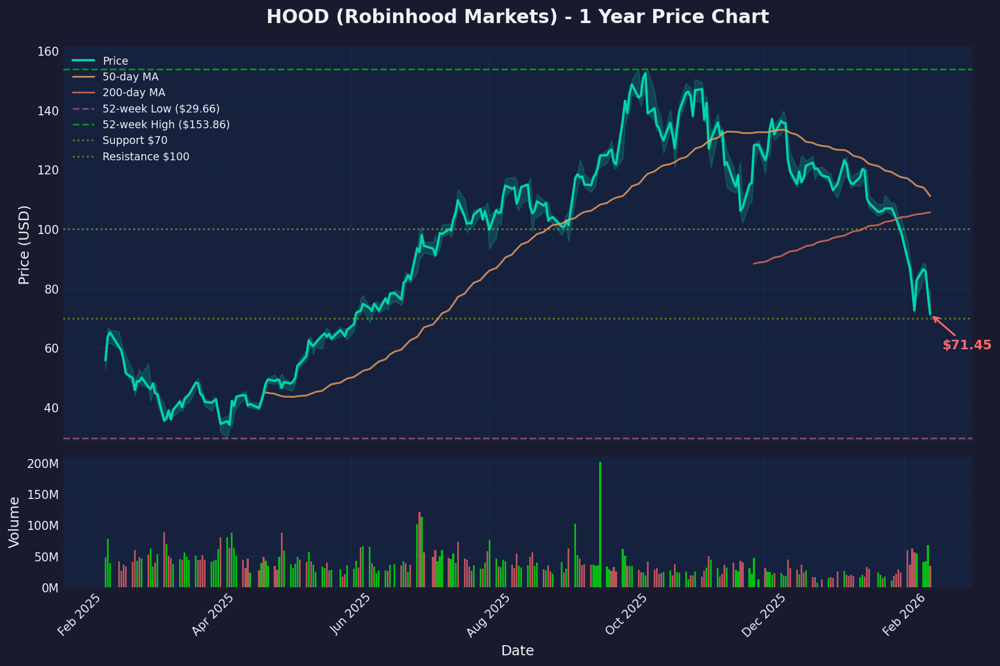

# HOOD Deep Dive - Robinhood Markets, Inc.
**Date:** 2026-02-12  
**Rating:** BUY  
**Price Target:** $115 (55% upside)  
**Current Price:** $74.14  
**Risk Level:** High

---

## Company Overview

| Field | Value |
|-------|-------|
| Headquarters | Menlo Park, California |
| Founded | 2013 |
| Sector / Industry | Financial Services / Capital Markets |
| Market Cap | $66.8B |
| Enterprise Value | $69.5B |
| Employees | 2,300 |
| CEO | Vlad Tenev |
| Description | Commission-free trading platform for stocks, ETFs, options, futures, crypto, and prediction markets |

---

## Investment Thesis

### Bull Case
- **Fintech SuperApp Evolution:** Successfully pivoted from meme-stock app to diversified platform with Gold Card, prediction markets, retirement accounts, and international expansion
- **Record Profitability:** FY2025 revenue $4.5B (+52% YoY), net income $1.9B — proving sustainable business model
- **Wealth Transfer Beneficiary:** Positioned to capture $84T generational wealth transfer with mobile-first, high-yield platform targeting Gen Z/Millennials
- **S&P 500 Inclusion:** Late 2025 inclusion brings institutional flows and index fund buying
- **Product Velocity:** More features launched in 2 years than first 8 years combined — Legend desktop, Gold Card, prediction markets, UK/EU expansion

### Bear Case
- **Crypto Dependency:** Transaction revenue still swings with BTC cycles; Q4 crypto revenue missed by $27M
- **Valuation Premium:** Trading at 36x P/E vs 15-20x for traditional brokers
- **CFO Transition:** Jason Warnick stepped down; Shiv Verma new CFO as of Feb 6
- **Revenue Miss Reaction:** Stock dropped 12% on Q4 miss despite strong full-year numbers — investors twitchy on growth deceleration
- **Aggressive Subsidies:** 3% IRA match expensive if retention doesn't hold

---

## Financial Summary

### Income Statement (TTM + 2yr history)
| Metric | FY2025 | FY2024 | FY2023 |
|--------|--------|--------|--------|
| Revenue | $4.47B | $2.95B | $1.87B |
| Revenue Growth % | +52% | +58% | +3% |
| Gross Profit | $4.13B | ~$2.7B | ~$1.7B |
| Gross Margin % | 92.4% | ~91% | ~91% |
| Operating Income | $2.09B | ~$1.2B | -$600M |
| Operating Margin % | 46.8% | ~40% | NM |
| Net Income | $1.88B | ~$1.0B | -$541M |
| EPS | $2.05 | $1.10 | -$0.61 |

### Balance Sheet
| Metric | Value |
|--------|-------|
| Cash & Equivalents | $12.42B |
| Total Debt | $11.84B |
| Net Cash (Debt) | $577M |
| Current Ratio | 1.13 |
| Debt/Equity | 1.29 |

### Cash Flow (TTM)
| Metric | Value |
|--------|-------|
| Operating Cash Flow | $1.64B |
| CapEx | -$15M |
| Free Cash Flow | $1.62B |
| FCF Margin % | 36.3% |

---

## Valuation

### Current Multiples
| Multiple | HOOD | Sector Avg | Premium/Discount |
|----------|------|------------|------------------|
| P/E (TTM) | 36.2x | 15-20x | +80% premium |
| P/E (Fwd) | 31.8x | 14-18x | +75% premium |
| EV/Revenue | 15.5x | 3-5x | +300% premium |
| P/FCF | 43.2x | 15-20x | +115% premium |
| P/B | 7.7x | 1-3x | +250% premium |

### Peer Comparison
| Company | Ticker | Market Cap | P/E | EV/Rev | Rev Growth % |
|---------|--------|------------|-----|--------|--------------|
| **Robinhood** | HOOD | $66.8B | 36.2x | 15.5x | +52% |
| Charles Schwab | SCHW | $140B | 22x | 4.5x | +8% |
| Interactive Brokers | IBKR | $75B | 25x | 6x | +18% |
| Coinbase | COIN | $55B | 28x | 8x | +35% |
| SoFi | SOFI | $18B | 45x | 7x | +30% |

*HOOD commands premium due to superior growth, but valuation assumes growth persists*

---

## Competitive Position

**Market Position:**
- Dominant among Gen Z/Millennial retail traders
- AUC: $333B (+119% YoY) — closing gap with legacy brokers
- Fastest-growing in retirement assets ($26B captured in 2025)

**Competitive Advantages (Moat):**
1. Brand recognition among younger demographics
2. Mobile-first UX that legacy brokers struggle to match
3. Product innovation velocity (prediction markets, 24/7 trading)
4. Network effects from social features

**Key Competitors:**
- Charles Schwab/TD Ameritrade (legacy, massive AUM)
- Fidelity (strong retirement, research)
- Interactive Brokers (active traders, international)
- Coinbase (crypto-only competitor)
- Webull, Public (direct retail competitors)

**Threats:**
- Schwab could improve mobile experience
- Crypto winter impacts transaction revenue
- Regulatory scrutiny on PFOF and gamification

---

## Recent Developments / Catalysts

### Q4 2025 Earnings (Feb 10, 2026)
- **Revenue:** $1.28B (missed $1.35B estimate)
- **Crypto Revenue:** $221M vs $248M expected (-38% YoY)
- **EPS:** $0.66 (beat $0.61, but -35% YoY)
- **AUC:** $333B (+119% YoY)
- **Gold Subscribers:** 4.2M

### Recent News
- **CFO Transition:** Shiv Verma replaced Jason Warnick (Feb 6)
- **S&P 500 Inclusion:** Added late 2025
- **UK Launch:** ISAs launching early 2026
- **Prediction Markets:** Fastest-growing product segment
- **Robinhood Legend:** Desktop platform competing with thinkorswim

### Upcoming Catalysts
- Next earnings: ~May 2026
- UK/EU traction data
- Potential "Robinhood Chain" L2 announcement (rumored)
- Crypto market stabilization/rally

---

## Social Chatter / Sentiment

| Source | Sentiment | Key Themes |
|--------|-----------|------------|
| Twitter/X | Mixed | "Buy the dip" vs "growth slowing" |
| r/wallstreetbets | Bullish | Comparing to COIN, meme potential |
| r/stocks | Mixed | Valuation concerns, but respect pivot |
| StockTwits | Bullish | 65% bullish sentiment |

**Notable Takes:**
- Bulls point to 94% upside to analyst PT, successful pivot to profitability
- Bears highlight crypto dependency, revenue miss pattern
- Retail sentiment more bullish than price action suggests

**Retail vs Institutional:** Retail buying the dip; institutions cautious on valuation after miss

---

## Charts

---

## Technical Analysis

| Level | Price | Notes |
|-------|-------|-------|
| Resistance 1 | $85 | Prior support now resistance |
| Resistance 2 | $100 | Psychological level |
| Current Price | $74.14 | |
| Support 1 | $70 | Round number, recent low |
| Support 2 | $60 | Major support zone |
| 50 DMA | $111.17 | Trading well below |
| 200 DMA | $105.69 | Trading well below |
| RSI | 27.84 | **Oversold** |

**Trend:** Downtrend (YTD -34%)  
**Relative Strength:** Lagging market significantly  
**Beta:** 2.44 (high volatility)

**Key Observation:** RSI at 27.84 is deeply oversold — typically signals near-term bounce potential

---

## Risk Factors

| Risk | Level | Notes |
|------|-------|-------|
| Execution Risk | Medium | New CFO, international expansion |
| Financial Risk | Low | Net cash positive, profitable, strong FCF |
| Competitive Risk | Medium | Legacy brokers improving, Coinbase in crypto |
| Regulatory Risk | Medium | PFOF scrutiny, crypto regulation |
| Macro/Sector Risk | High | Crypto cycles directly impact revenue |
| Valuation Risk | High | Trading at significant premium to peers |

---

## Investment Summary / Bottom Line

### Rating Justification

Robinhood has successfully completed its transformation from a controversial meme-stock app to a legitimate, profitable fintech platform. The FY2025 numbers are undeniably impressive: $4.5B revenue (+52%), $1.9B net income, and AUC crossing $333B. The company is executing on multiple fronts — international expansion, product diversification, and high-net-worth customer acquisition.

The Q4 miss is a speed bump, not a structural problem. Crypto revenue volatility is real but manageable given the diversification into Gold subscriptions, net interest income, and prediction markets. The CFO transition adds uncertainty but Verma is an internal promotion with institutional knowledge.

At $74.14 with RSI at 27.84, the stock is technically oversold after a 34% YTD drawdown. Wall Street's mean price target of $113.74 implies 53% upside. While valuation remains rich (36x P/E), the growth rate justifies some premium. The risk/reward at these levels favors buyers with a 6-12 month horizon.

### Trade Suggestion

- **Entry:** $70 - $78 range (current levels or slight dip)
- **Stop Loss:** $58 (22% downside — below major support)
- **Target 1:** $95 (28% upside — 200 DMA reclaim)
- **Target 2:** $115 (55% upside — analyst consensus area)
- **Position Size:** Small to Medium (high beta = position sizing matters)
- **Time Horizon:** 6-12 months

**Alternative:** For lower risk, wait for $70 support test or 50 DMA reclaim above $111

---

## References / Sources

**Company Filings:**
- [Q4 2025 Earnings Release](https://investors.robinhood.com)

**News & Analysis:**
- [Barchart - Should You Buy, Sell, or Hold HOOD Stock](https://www.barchart.com/story/news/163667/should-you-buy-sell-or-hold-hood-stock-in-february-2026)
- [FinancialContent - Deep Dive: Robinhood Transitions to Financial SuperApp](https://markets.financialcontent.com/wral/article/finterra-2026-2-11-deep-dive-robinhood-hood-transitions-to-financial-superapp-following-q4-2025-earnings)

**Data Sources:**
- [Stock Analysis - HOOD Statistics](https://stockanalysis.com/stocks/hood/statistics/)
- [Yahoo Finance - HOOD](https://finance.yahoo.com/quote/HOOD)

---

*Report generated by Jai | Last updated: 2026-02-12*
